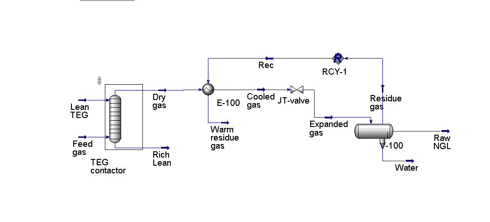
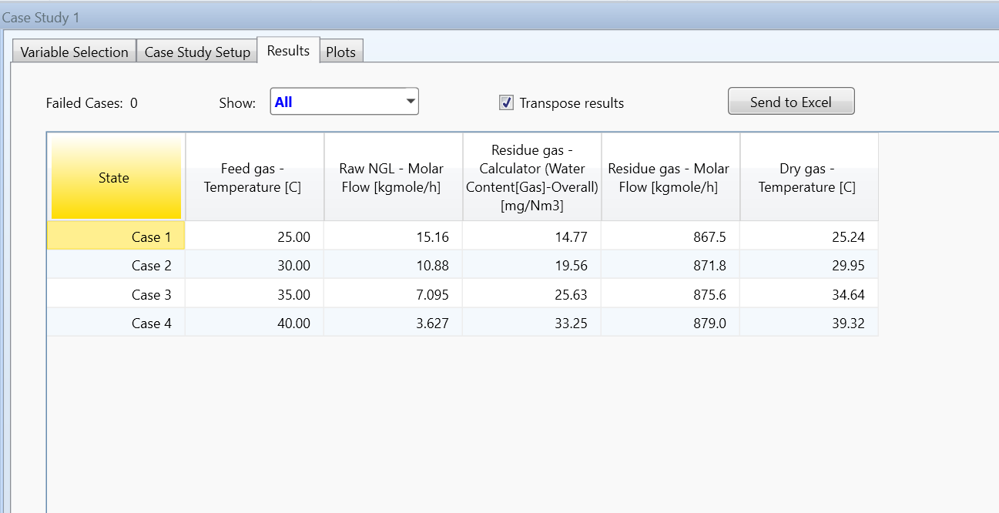

# Natural Gas Processing — TEG Dehydration & JT Throttling

Simulation of a 20 MMscf/d natural gas processing plant in Aspen HYSYS. The goal was simple: take wet, high-pressure gas from the wellhead, dry it, drop the pressure, and recover liquid hydrocarbons — all without a refrigeration unit.

---

## Flowsheet

---

## Tools
- **Aspen HYSYS** (Peng-Robinson EOS)
- HYSYS Hydrate Utility
- HYSYS Case Study (sensitivity analysis)

---

## How the Process Works

Think of it as a four-step chain:

**1. TEG Contactor** — Wet gas enters and meets glycol (TEG) flowing the opposite way. The glycol soaks up the water, leaving dry gas at the top.

**2. Heat Exchanger (E-100)** — The dry gas gets pre-cooled by the cold gas coming back from the separator. This saves energy and makes the next step more effective.

**3. JT Valve (70 bar → 30 bar)** — Gas expands through a valve and its temperature drops sharply (Joule-Thomson effect). This cold temperature causes heavier hydrocarbons to condense out as liquid.

**4. Three-Phase Separator (V-100)** — The expanded stream splits into three: sales gas, raw NGL (liquid hydrocarbons), and water.

The cold sales gas loops back through E-100 to pre-cool the incoming dry gas — this recycle (RCY-1) converged cleanly in just 4 iterations.

---

## Results

### Base Case (Feed at 30°C)

| Output | Value |
|---|---|
| Raw NGL recovered | 10.88 kgmol/hr |
| Water in sales gas | 19.56 mg/Nm³ |
| Residue gas flow | 871.8 kgmol/hr |
| Failed simulation cases | 0 / 4 |

### Hydrate Check — Expanded Gas

Result: **Will NOT Form** — confirmed safe operating conditions after JT expansion. Used Ng & Robinson model.

### Sensitivity Analysis — What happens when the feed gets warmer?

| Feed Temp (°C) | NGL (kgmol/hr) | Water in Gas (mg/Nm³) | Dry Gas Temp (°C) |
|---|---|---|---|
| 25 | 15.16 | 14.77 | 25.24 |
| **30 (base)** | **10.88** | **19.56** | **29.95** |
| 35 | 7.10 | 25.63 | 34.64 |
| 40 | 3.63 | 33.25 | 39.32 |

A 15°C rise in feed temperature caused NGL recovery to fall by **~76%** and water in the sales gas to more than double. This matters a lot in the Niger Delta where wellhead temperatures shift with weather and time of day — a plant designed only for 30°C could underperform significantly in hotter conditions.

---

## What I Learned

- The JT valve drops pressure, not temperature directly — the temperature drop is a consequence of the feed conditions. Warmer feed = warmer expanded gas = less condensation. The sensitivity study made this very clear.
- Setting up the recycle loop (RCY-1) taught me how HYSYS handles circular dependencies and how to set initial estimates to help convergence.
- Checking for hydrate formation before calling a design complete is not optional — the temperature after a JT valve can easily fall into the hydrate zone.
